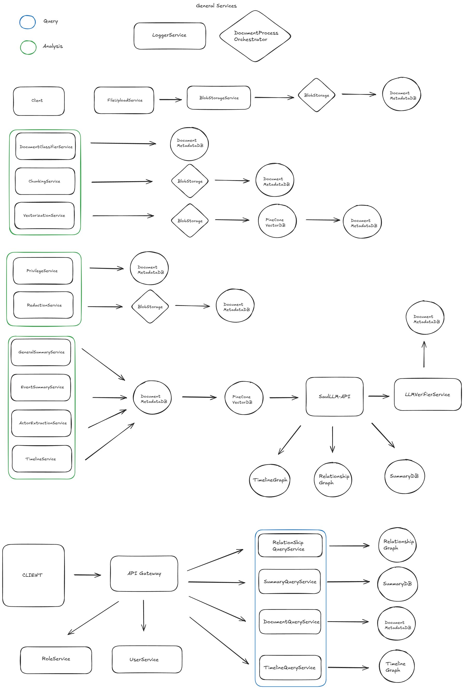

# 🧾 Legal Document Intelligence Platform

A scalable, multi-tenant system for analyzing, classifying, and summarizing legal documents through agentic AI workflows. Designed to enable law firms to extract structure, timelines, actors, relationships, and summaries from unstructured legal documents while respecting role-based access control (RBAC) and tenant isolation.

---

## Project Goals

This platform is designed to:

- Automatically classify and chunk legal documents
- Extract timelines, actors, summaries, and relationships
- Build vector-based semantic search on document chunks
- Create an updatable knowledge graph of legal events and actors
- Enforce strong role-based access within tenants (law firms)
- Support multi-tenancy with one database per tenant
- Leverage local LLMs like **SaulLM** instead of expensive APIs
- Orchestrate services with **Temporal** for robust fault-tolerant pipelines

---

## System Architecture

### Key Services

| Service                     | Responsibility |
|----------------------------|----------------|
| **FileUploadService**      | Uploads and stores files in blob storage |
| **DocumentClassifierService** | Detects type (contract, memo, etc.) |
| **ChunkingService**        | Breaks docs into manageable text segments |
| **VectorizationService**   | Embeds chunks to Pinecone |
| **GeneralSummaryService**  | Provides overview summary |
| **EventSummaryService**    | Extracts timeline-based summaries |
| **ActorExtractionService** | Identifies parties and roles |
| **TimelineService**        | Creates time-based narrative flow |
| **RelationService**        | Maps actor relationships |
| **PrivilegeService**       | Marks privilege/confidentiality status |
| **LLMVerifierService**     | Checks for hallucinations or inconsistencies |
| **SaulLM-API**             | Local LLM endpoint for summaries |
| **DocumentProcessOrchestrator** | Temporal-based orchestrator for the full pipeline |
| **API Gateway**            | Single point of entry for client requests |
| **Query Services**         | Expose summaries, timelines, and relationships |

---

### System Design

---

## Tech Stack

| Component | Technology |
|----------|-------------|
| **Orchestration** | [Temporal](https://temporal.io/) |
| **Vector DB** | [Pinecone](https://www.pinecone.io/) |
| **LLM Inference** | [SaulLM](https://huggingface.co/saulx/saullm) (Dockerized) |
| **Backend** | Python (FastAPI for APIs) |
| **Workflow** | Python SDK for Temporal |
| **Storage** | Blob storage (e.g., S3, MinIO) + SQL (PostgreSQL per tenant) + optional NoSQL |
| **Containerization** | Docker, Docker Compose |
| **Future Deployment** | Kubernetes for orchestration, Terraform for infra-as-code |

